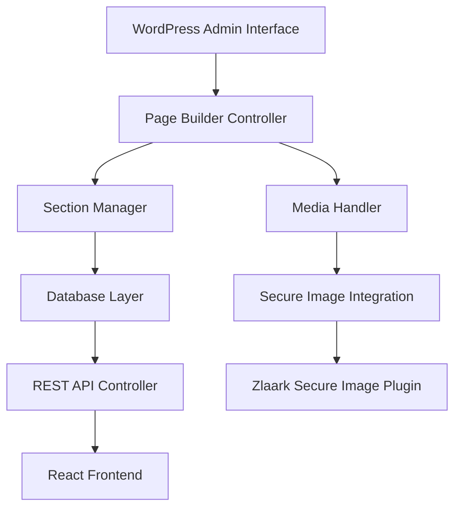

# Design Document

## Overview

The Custom Page Builder plugin is a WordPress plugin that provides a visual interface for creating and managing custom pages with section-based content. The plugin consists of an admin interface for content creation, a database layer for content storage, REST API endpoints for frontend consumption, and integration with the existing Zlaark secure image plugin for protected media handling.

## Architecture

### High-Level Architecture



### Plugin Structure

```
custom-page-builder/
├── custom-page-builder.php          # Main plugin file
├── includes/
│   ├── class-plugin.php              # Core plugin class
│   ├── class-installer.php           # Plugin activation/deactivation
│   └── class-uninstaller.php         # Plugin cleanup
├── admin/
│   ├── class-admin-interface.php     # Admin menu and pages
│   ├── class-page-builder.php        # Page builder interface
│   ├── class-section-manager.php     # Section CRUD operations
│   └── assets/
│       ├── css/
│       └── js/
├── api/
│   ├── class-rest-controller.php     # REST API endpoints
│   └── class-api-validator.php       # Request validation
├── models/
│   ├── class-custom-page.php         # Page model
│   ├── class-section.php             # Section model
│   └── class-section-factory.php     # Section type factory
├── integrations/
│   └── class-secure-image-handler.php # Secure image integration
└── templates/
    └── admin/
        ├── page-builder.php          # Main builder interface
        └── section-templates/         # Section configuration templates
```

## Components and Interfaces

### Core Components

#### 1. Plugin Class
```php
class CustomPageBuilder {
    public function init(): void
    public function activate(): void
    public function deactivate(): void
    private function load_dependencies(): void
    private function define_admin_hooks(): void
    private function define_api_hooks(): void
}
```

#### 2. Admin Interface
```php
class AdminInterface {
    public function add_admin_menu(): void
    public function enqueue_admin_assets(): void
    public function render_page_builder(): void
    public function handle_ajax_requests(): void
}
```

#### 3. Page Builder Controller
```php
class PageBuilder {
    public function create_page(array $data): int
    public function update_page(int $page_id, array $data): bool
    public function delete_page(int $page_id): bool
    public function get_page(int $page_id): ?CustomPage
    public function duplicate_page(int $page_id): int
}
```

#### 4. Section Manager
```php
class SectionManager {
    public function create_section(int $page_id, string $type, array $config): int
    public function update_section(int $section_id, array $config): bool
    public function delete_section(int $section_id): bool
    public function reorder_sections(int $page_id, array $order): bool
    public function get_sections_by_page(int $page_id): array
}
```

#### 5. REST API Controller
```php
class RestController extends WP_REST_Controller {
    public function register_routes(): void
    public function get_pages(WP_REST_Request $request): WP_REST_Response
    public function get_page(WP_REST_Request $request): WP_REST_Response
    public function permission_callback(WP_REST_Request $request): bool
}
```

### Section Types

#### Base Section Interface
```php
interface SectionInterface {
    public function get_type(): string
    public function get_config_schema(): array
    public function validate_config(array $config): bool
    public function render_admin_template(): string
    public function to_api_response(): array
}
```

#### Section Types Implementation

1. **Testimonials Section**
   - Multiple testimonial cards
   - Star ratings, text, author info
   - Configurable layout (grid/slider)

2. **Product Grid Section**
   - Product cards with images, titles, prices
   - Grid layout configuration
   - Integration with WooCommerce (optional)

3. **Hero Banner Section**
   - Background image/video
   - Title, subtitle, CTA button
   - Overlay and positioning options

4. **Category Showcase Section**
   - Category cards with images and titles
   - Grid or slider layout
   - Link configuration

5. **Content Block Section**
   - Rich text editor
   - Image placement options
   - Two-column layouts

## Data Models

### Database Schema

#### Custom Pages Table
```sql
CREATE TABLE wp_custom_pages (
    id bigint(20) NOT NULL AUTO_INCREMENT,
    title varchar(255) NOT NULL,
    slug varchar(255) NOT NULL UNIQUE,
    status enum('draft', 'published', 'archived') DEFAULT 'draft',
    created_at datetime DEFAULT CURRENT_TIMESTAMP,
    updated_at datetime DEFAULT CURRENT_TIMESTAMP ON UPDATE CURRENT_TIMESTAMP,
    published_at datetime NULL,
    author_id bigint(20) NOT NULL,
    meta_data longtext,
    PRIMARY KEY (id),
    KEY idx_slug (slug),
    KEY idx_status (status),
    KEY idx_author (author_id)
);
```

#### Page Sections Table
```sql
CREATE TABLE wp_custom_page_sections (
    id bigint(20) NOT NULL AUTO_INCREMENT,
    page_id bigint(20) NOT NULL,
    section_type varchar(50) NOT NULL,
    section_order int(11) NOT NULL DEFAULT 0,
    config longtext NOT NULL,
    created_at datetime DEFAULT CURRENT_TIMESTAMP,
    updated_at datetime DEFAULT CURRENT_TIMESTAMP ON UPDATE CURRENT_TIMESTAMP,
    PRIMARY KEY (id),
    KEY idx_page_id (page_id),
    KEY idx_page_order (page_id, section_order),
    FOREIGN KEY (page_id) REFERENCES wp_custom_pages(id) ON DELETE CASCADE
);
```

### Data Models

#### CustomPage Model
```php
class CustomPage {
    private int $id;
    private string $title;
    private string $slug;
    private string $status;
    private DateTime $created_at;
    private DateTime $updated_at;
    private ?DateTime $published_at;
    private int $author_id;
    private array $meta_data;
    private array $sections;
    
    public function to_array(): array
    public function to_api_response(): array
    public static function from_database(array $data): self
}
```

#### Section Model
```php
class Section {
    private int $id;
    private int $page_id;
    private string $section_type;
    private int $section_order;
    private array $config;
    private DateTime $created_at;
    private DateTime $updated_at;
    
    public function to_array(): array
    public function to_api_response(): array
    public function validate(): bool
}
```

## Error Handling

### Exception Classes
```php
class PageBuilderException extends Exception {}
class SectionValidationException extends PageBuilderException {}
class SecureImageException extends PageBuilderException {}
class ApiValidationException extends PageBuilderException {}
```

### Error Response Format
```json
{
    "success": false,
    "error": {
        "code": "VALIDATION_ERROR",
        "message": "Invalid section configuration",
        "details": {
            "field": "image_url",
            "reason": "Required field missing"
        }
    }
}
```

## Testing Strategy

### Unit Tests
- Model validation and data transformation
- Section type configuration validation
- API response formatting
- Secure image integration

### Integration Tests
- Database operations (CRUD)
- REST API endpoints
- Admin interface functionality
- Secure image plugin integration

### End-to-End Tests
- Complete page creation workflow
- Frontend API consumption
- Image upload and security
- Page publication and status changes

## Security Considerations

### Input Validation
- Sanitize all user inputs
- Validate section configurations against schemas
- Prevent XSS in rich text content
- File upload restrictions

### Authentication & Authorization
- WordPress capability checks
- Nonce verification for admin actions
- API authentication for sensitive endpoints
- Role-based access control

### Secure Image Integration
- Automatic image protection on upload
- Token-based image access
- Integration with existing security policies
- Fallback handling for plugin conflicts

## Performance Optimizations

### Caching Strategy
- Page data caching with WordPress transients
- API response caching
- Image metadata caching
- Section configuration caching

### Database Optimization
- Proper indexing on frequently queried fields
- Efficient section ordering queries
- Pagination for large datasets
- Query optimization for API endpoints

### Frontend Optimization
- Lazy loading for admin interface
- Minified and compressed assets
- CDN integration for static assets
- Image optimization through secure image plugin

## Integration Points

### Secure Image Plugin Integration
```php
class SecureImageHandler {
    public function process_uploaded_image(int $attachment_id): array
    public function get_secure_image_url(int $attachment_id, string $size): string
    public function is_secure_image_plugin_active(): bool
    public function handle_image_in_section(array &$section_config): void
}
```

### WordPress Integration
- Custom post type registration (optional)
- WordPress media library integration
- User capability system
- WordPress hooks and filters
- Multisite compatibility

### REST API Integration
- WordPress REST API framework
- Custom endpoints registration
- Authentication integration
- CORS handling for React frontend